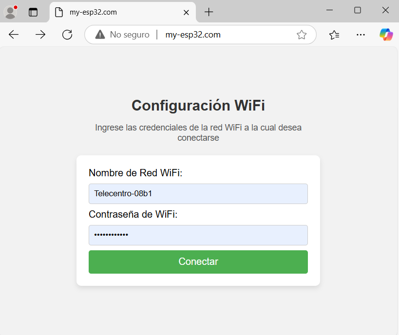
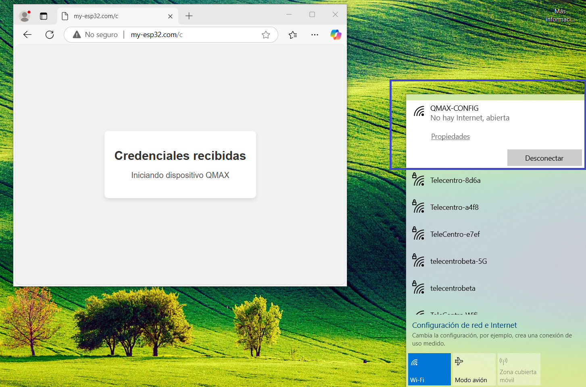
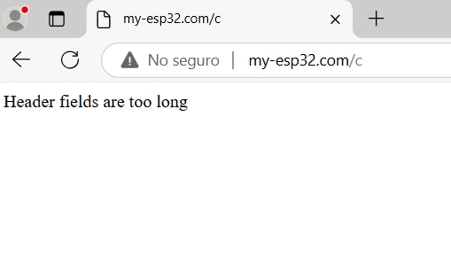
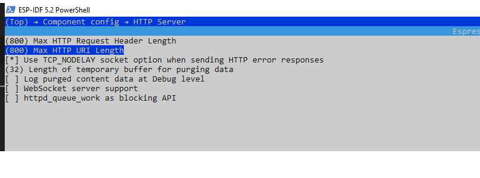

# WiFi Credential Manager API for ESP32

Este proyecto es una API para gestionar dinámicamente las credenciales WiFi en un ESP32 mediante una interfaz web. Permite que el usuario ingrese el SSID y la contraseña de su red WiFi a través de un formulario web. Una vez configuradas, las credenciales se almacenan en memoria, el sistema se reinicia y el ESP32 intenta conectarse a la red especificada. Si la conexión falla, el dispositivo regresa al modo interfaz web para que el usuario vuelva a ingresar las credenciales.





### Interfaz sencilla

```c
/**
* @brief Start the configuration application
*
* @param main_aplication function that is called and used to call the main application
* @param error function that is called when an error occurs.
 */
void api_config(esp_callback_t main_aplication, esp_callback_t error);

```

### Ejemplo de uso

```c
#include <stdio.h>
#include "api_config.h"


void main_aplication(void){
    printf("This is my main aplication\n");
}


void error(void){
    printf("Error in api_config, reset\n");
}


void app_main(void)
{
    api_config(main_aplication,error);
}

```


## Estado del Proyecto
> **Nota:** Este proyecto está en desarrollo y no está listo para un uso completo en producción. Faltan mejoras en eficiencia y almacenamiento, así como otras funcionalidades adicionales.

## Descripción
Este proyecto proporciona una forma fácil y dinámica de gestionar la configuración WiFi en dispositivos ESP32. Las principales características son:

1. **Interfaz Web para Configuración WiFi**: El usuario puede ingresar el nombre de la red (SSID) y la contraseña a través de una página web servida por el ESP32.
2. **Almacenamiento de Credenciales en Memoria**: Las credenciales se guardan para usarse en futuros reinicios del dispositivo.
3. **Intento de Conexión Automático**: Después de reiniciar, el ESP32 intenta conectarse automáticamente con las credenciales proporcionadas.
4. **Modo de Recuperación**: Si la conexión falla (por ejemplo, si la contraseña es incorrecta), el ESP32 regresa a la interfaz de configuración web para que el usuario pueda volver a ingresar las credenciales.

## Características Implementadas
- **Formulario Web**: La interfaz web permite ingresar SSID y contraseña para conectarse a una red WiFi.
- **Almacenamiento en memoria no volatil**: Las credenciales se almacenan  en la memoria (NVS flash ) del ESP32.

## Características Futuras
Se planean las siguientes mejoras para futuras versiones del proyecto:
- **Uso de NVS (Non-Volatile Storage)**: Obtener la página HTML desde  memoria NVS mediante la herramienta de particiones de Espressif, optimizando el espacio de memoria y la persistencia de datos.
- **Implementación de WebSockets**: Permitir actualizaciones en tiempo real para una experiencia de usuario más fluida.
- **Configuración Adicional de Parámetros**: Agregar opciones avanzadas para configurar otros parámetros de red y del dispositivo.
- **Mejoras en la Eficiencia del Código**: Optimizar el código para un rendimiento más rápido y estable.

## Requisitos del Sistema
- **ESP32**: Este proyecto está diseñado para dispositivos ESP32.
- **Framework IDF**: Debe estar instalado para compilar y cargar el código en el ESP32.
- **Agregar IDF_PATH al path de tu sistema**: para poder usar el comando ```idf.py build```

## Instalación y Uso
1. **Clonar el repositorio**:
    ```bash
    git clone https://github.com/usuario/esp32-wifi-credential-manager.git

    ```
2. **Abrir el proyecto** en tu entorno de desarrollo.
3. **Configurar los ajustes de red** en el archivo de configuración si es necesario.
4. **Cargar el código** en el ESP32.
    ```bash
    
    idf.py build flash monitor
    ```
5. **Acceder a la interfaz web**: Una vez iniciado el ESP32, acceder a la dirección IP del dispositivo desde un navegador web y completar el formulario de configuración WiFi. La red WiFi se llama ```QMAX-CONFIG``` y el portal se encuentra en:
```http://my-esp32.com```




### (SOLUCIONADO) ERROR: HEARDER FIELD ARE TOO LONG
Por defecto la configuracion del proyecto asigna buffer de 500 bytes al servidor HTTP.
Necesitamos cambiar ese valor para evitar el siguiente error:



Para solucionarlo ejecuto
```c
    idf.py menuconfig
```
Llamara al menu de configuracion de la aplicacion


Me dirijo por el menu por las siguientes opciones:
```
Component config -> HTTP Server
Cambio de 500 a 800 en las primeras dos opciones:
(800) Max HTTP Request Header Lenght
(800) Max HTTP URI Length
 ```
 Para guardar cambios CRL + S y luego con Q salgo de la interfaz.
 Los cambios quedan almacenados en el archivo sdkconfig. Debido a que ignoramos este archivo en el .gitignore tenemos que realizar este paso cada vez que clonamos este repo.

## Contribuciones
Este proyecto está en desarrollo y es de código abierto. Las contribuciones para mejorar su eficiencia y añadir nuevas características son bienvenidas.

## Licencia
Este proyecto se distribuye bajo la licencia MIT. Consulta el archivo `LICENSE` para obtener más detalles.
